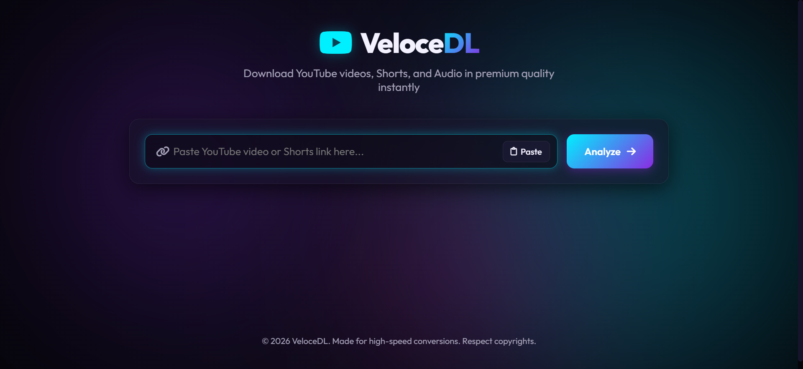
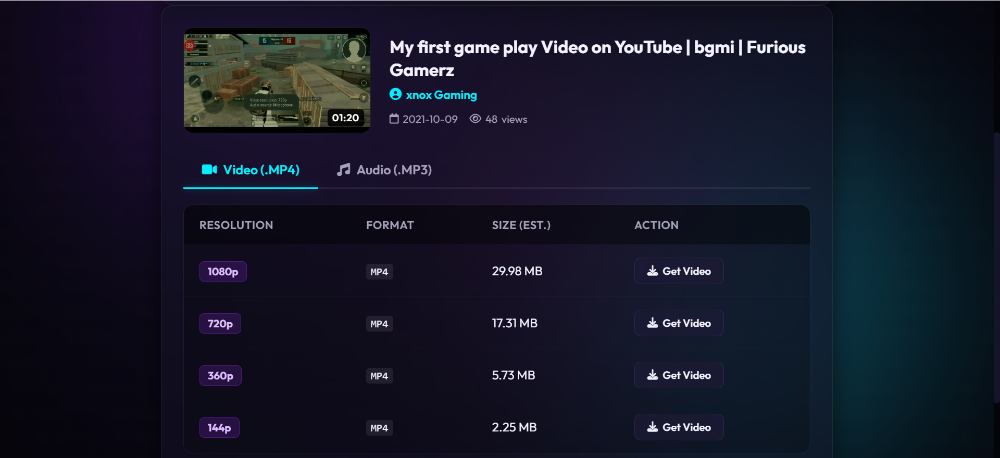
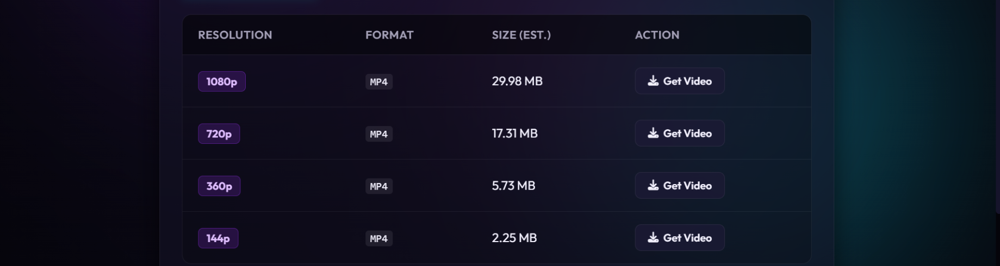
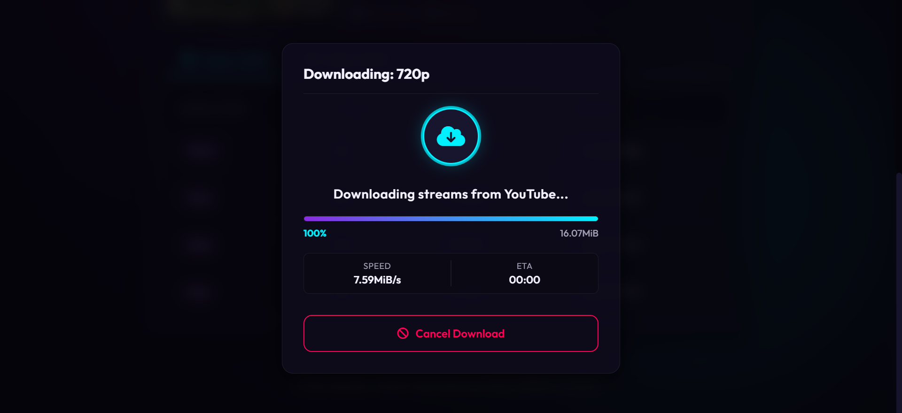
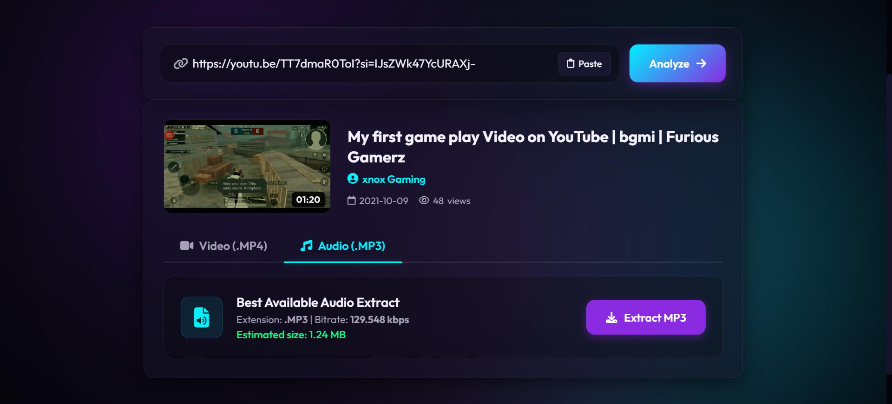
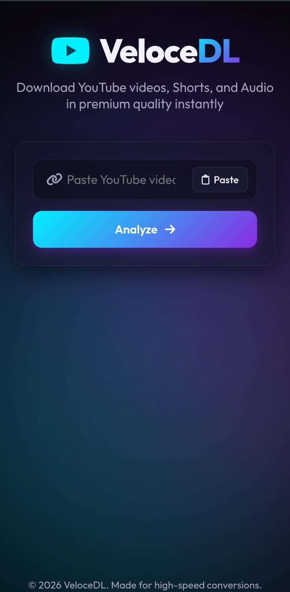

# VeloceDL

<div align="center">


<br><br>

# 🎬 YouTube Video & Audio Downloader

### Fast • Modern • Secure • Responsive

Download YouTube videos, Shorts, and audio with multiple quality options, real-time progress tracking, and automatic file cleanup.

⭐ Star this repository if you find it useful!

</div>

---

## ✨ Features

### 🎥 Video Downloads
- Download YouTube Videos & Shorts
- Multiple quality options (360p, 480p, 720p, 1080p, etc.)
- Fast downloads powered by **yt-dlp**
- Direct download links

### 🎵 Audio Downloads
- Extract audio from YouTube videos
- High-quality audio conversion
- Fast processing using FFmpeg

### 📊 Real-Time Progress Tracking
- Live download progress
- Server-Sent Events (SSE)
- Download status updates

### 🖼️ Rich Video Information
- Thumbnail Preview
- Video Title
- Channel Information
- Duration
- View Count
- Available Formats

### 🔒 Security Features
- URL Validation
- Rate Limiting
- Secure File Handling
- Temporary File Cleanup

### 📱 Responsive UI
- Mobile Friendly
- Tablet Friendly
- Desktop Optimized
- Modern Dark Theme

---

# 📸 Project Screenshots

## 🏠 Home Page



*Clean and modern landing page.*

---

## 🔍 Video Information



*Displays metadata, thumbnail, duration, and available formats.*

---

## 🎬 Quality Selection



*Choose your preferred video quality before downloading.*

---

## 📊 Download Progress



*Real-time download progress updates.*

---

## 🎵 Audio Download



*Download high-quality audio instantly.*

---

## 📱 Mobile View



*Responsive interface optimized for mobile devices.*

---

# 🖼️ Screenshot Gallery

<p align="center">
  
  
</p>

<p align="center">
  
  
</p>

---

# 🛠️ Tech Stack

| Technology | Purpose |
|------------|----------|
| Node.js | Backend Runtime |
| Express.js | Web Server |
| yt-dlp | Video Extraction |
| FFmpeg | Audio & Video Processing |
| HTML5 | Frontend |
| CSS3 | Styling |
| JavaScript | Client Logic |
| Docker | Containerization |

---

# 📂 Project Structure

```text
project/
│
├── public/
│   ├── index.html
│   ├── style.css
│   └── app.js
│
├── src/
│   ├── server.js
│   ├── downloader.js
│   ├── config.js
│   └── utils.js
│
├── downloads/
│
├── screenshots/
│   ├── home.png
│   ├── video-info.png
│   ├── quality-selection.png
│   ├── download-progress.png
│   ├── audio-download.png
│   └── mobile-view.png
│
├── Dockerfile
├── start.js
├── main.js
├── package.json
└── README.md
```

---

# ⚡ Installation

## Clone Repository

```bash
git clone https://github.com/yourusername/youtube-downloader.git
cd youtube-downloader
```

## Install Dependencies

```bash
npm install
```

## Configure Environment

Create a `.env` file:

```env
PORT=3000
YT_DLP_PATH=yt-dlp
FFMPEG_PATH=ffmpeg
DOWNLOAD_DIR=downloads
MAX_CONCURRENT_DOWNLOADS=3
```

---

# 🚀 Running the Application

## Development

```bash
npm run dev
```

## Production

```bash
npm start
```

Application:

```text
http://localhost:3000
```

---

# 🌐 API Endpoints

## Get Video Information

```http
POST /api/info
```

Request:

```json
{
  "url": "https://youtube.com/watch?v=xxxx"
}
```

---

## Start Download

```http
POST /api/download/start
```

Request:

```json
{
  "url": "https://youtube.com/watch?v=xxxx",
  "format": "720p"
}
```

---

## Track Progress

```http
GET /api/download/progress/:taskId
```

Returns live progress updates using Server-Sent Events (SSE).

---

# 🔥 Highlights

- ✅ YouTube Video Downloads
- ✅ YouTube Shorts Support
- ✅ Audio Extraction
- ✅ Quality Selection
- ✅ Live Progress Tracking
- ✅ Responsive UI
- ✅ Automatic File Cleanup
- ✅ Docker Support
- ✅ yt-dlp Integration
- ✅ FFmpeg Processing

---

# 🐳 Docker Support

## Build Image

```bash
docker build -t youtube-downloader .
```

## Run Container

```bash
docker run -p 3000:3000 youtube-downloader
```

---

# 📈 Future Improvements

- Playlist Downloads
- Batch Downloads
- User Accounts
- Download History
- Custom Themes
- Multi-Language Support
- Cloud Storage Integration

---

# 🤝 Contributing

Contributions are welcome!

1. Fork the Repository
2. Create a Feature Branch
3. Commit Changes
4. Push to GitHub
5. Create a Pull Request

---

# 📜 License

This project is intended for educational and personal use only.

Please respect YouTube's Terms of Service and copyright regulations.

---

<div align="center">

## ⭐ Support

If you like this project, please consider giving it a star on GitHub.

### Made with ❤️ by STW

</div>
